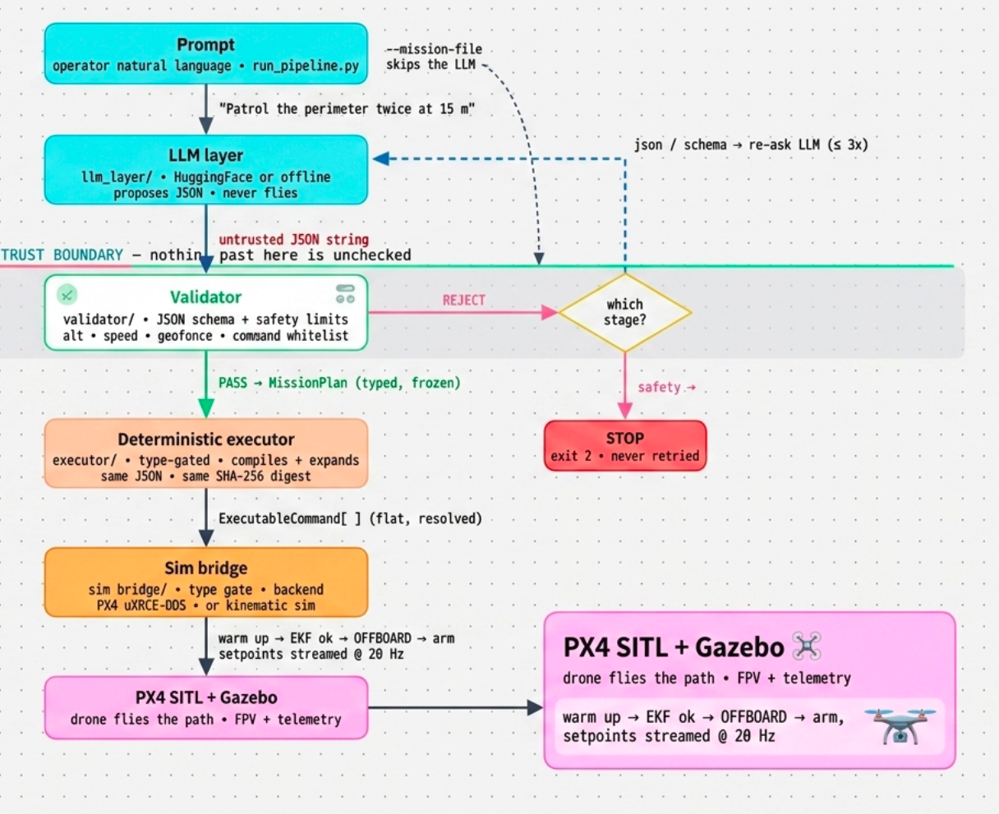
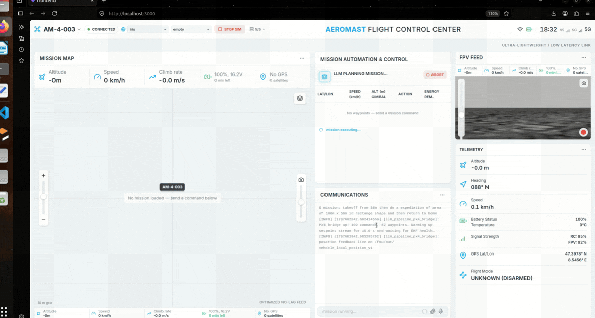
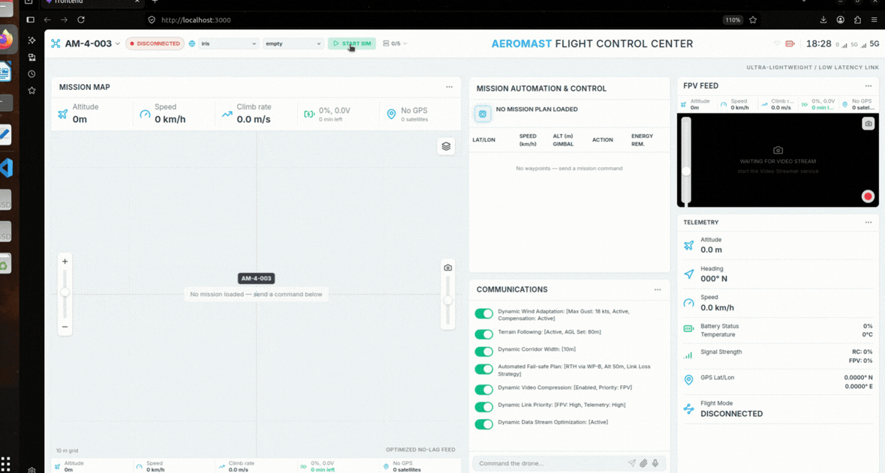

<div align="center">

# AI AeroMast Operator

**Natural-language → validated mission → deterministic execution on a simulated PX4 drone.**

An operator types a plain-English instruction. A language model *proposes* a mission as JSON.
A validator checks it against a schema and hard safety limits. A deterministic executor compiles
it to fixed commands. Only then does a simulated drone fly it — the language model is never in the
control loop.

[](https://www.python.org/)
[](https://docs.ros.org/en/humble/)
[](https://px4.io/)
[](https://classic.gazebosim.org/)
[](https://www.docker.com/)
[](https://react.dev/)
[](https://fastapi.tiangolo.com/)
[](LICENSE)

</div>

<br>

<div align="center">
  
</div>

<br>

---

## Pipeline

```
Prompt  ─►  LLM  ─►  validated mission JSON  ─►  deterministic executor  ─►  PX4 SITL / Gazebo
```

| Stage | Responsibility | Code |
|:--|:--|:--|
| **Prompt** | The operator's natural-language instruction. | — |
| **LLM** | Proposes a mission as a JSON string. It only proposes — it never flies. | `llm_layer/` |
| **Validated JSON** | Parsed, checked against a JSON Schema, then against per-vehicle safety limits (altitude, speed, geofence, command whitelist). This is the trust boundary. | `validator/`, `schema/` |
| **Deterministic executor** | Type-gated to the validated plan only; compiles it to a flat command sequence and emits a SHA-256 digest. Same JSON in ⇒ identical behaviour, every time. | `executor/` |
| **Simulator** | PX4 SITL flies the mission in Gazebo over the uXRCE-DDS bridge. | `sim_bridge/` |

The one path from a prompt to the propellers runs **through** the validator and the type-gated
executor. A rejected plan never advances: a formatting error is re-asked from the LLM (up to three
times); a **safety** violation stops the run and is never retried.

<br>

<div align="center">
  
  <br><sub><b>Prompt in → LLM proposes → validated → drone flies the compiled path.</b></sub>
</div>

<br>

---

## What happens when you start it

The whole stack runs from one Docker image. On `docker run`, the container's entrypoint:

1. Sources ROS 2 Humble and the built `px4_msgs` workspace.
2. Starts **`control_api`** (FastAPI, port `8000`) — the orchestrator.
3. Serves the **dashboard UI** (port `3000`).

You open the dashboard and press **START SIM**. `control_api` then launches, in order:

```
uXRCE-DDS agent  →  PX4 SITL + Gazebo Classic  →  rosbridge  →  telemetry node  →  video streamer
```

Once the sim is up you type a mission. `run_pipeline.py` drives the four stages:

1. **`[1/4] LLM`** — `propose_mission_json()` returns an untrusted JSON string (Hugging Face, or a
   deterministic offline parser when no token is set). Blocked providers and truncated replies are
   retried automatically.
2. **`[2/4] Validate`** — `validate_mission()` runs schema → safety checks and returns a frozen
   `MissionPlan`, or raises a rejection tagged `json` / `schema` / `safety`.
3. **`[3/4] Compile`** — `compile_mission()` unrolls loops, expands `GRID` / `ORBIT` / `SPIRAL`
   patterns into exact waypoints, and prints the command count + digest.
4. **`[4/4] Execute`** — the PX4 bridge warms up the setpoint stream, waits for EKF health, switches
   to OFFBOARD, arms, and walks the command list at 20 Hz while telemetry and the camera feed stream
   back to the dashboard.

<br>

<div align="center">
  
  <br><sub><b>Ground-control dashboard — telemetry, mission map, FPV camera, and the command console.</b></sub>
</div>

<br>

---

## Quick start

### Full simulation (PX4 + ROS 2 + Gazebo + dashboard, in one container)

```bash
git clone https://github.com/prasadghumare1101/drone_llm_pipeline.git
cd drone_llm_pipeline

# build the all-in-one image
DOCKER_BUILDKIT=1 docker build -f docker/Dockerfile.sim -t drone-llm-sim .

# run — opens the dashboard + Gazebo GUI
IMAGE=drone-llm-sim ./docker/run_dashboard.sh
```

Open **http://localhost:3000**, pick a world, press **START SIM**, and type a mission.

### Pipeline only (no ROS, ~150 MB image)

Runs the full `prompt → validate → compile → kinematic sim` path with one dependency:

```bash
docker build -t drone-llm-pipeline .
docker run --rm drone-llm-pipeline \
  --prompt "Patrol the perimeter loop twice at 15 metres" --llm offline --dry-run
```

<br>

## Example prompts

```
Patrol the perimeter loop twice at 15 metres
Take off to 40 metres, fly a 100 metre square, then land
Survey a 120 by 120 metre field at 50 metres, photograph each pass, then return to launch
Climb to 45 metres, fly an expanding spiral search from the centre, then RTL
```

Each prints the proposed JSON, a `PASS`, the compiled command count with its digest, then flies the
path. An unsafe mission is rejected with the exact rule it broke and a non-zero exit code.

<br>

## Repository layout

```
llm_layer/            prompt → untrusted JSON (Hugging Face + offline backends)
validator/            JSON Schema + per-vehicle safety limits  (the trust boundary)
executor/             deterministic compiler + pattern expansion (GRID/ORBIT/SPIRAL)
sim_bridge/           PX4 uXRCE-DDS bridge, kinematic sim, MAVSDK / Nav2 backends
schema/               mission_schema.json
aero_gcs/             React dashboard + FastAPI orchestrator (control_api, telemetry, video)
docker/               all-in-one sim image, dashboard run scripts, diagnostics
tests/                pipeline + validator + pattern tests
run_pipeline.py       the end-to-end driver
```

<br>

## Safety model

Safety is structural, not by convention:

- The **validator** is the only path from untrusted text to a trusted plan. It enforces the schema
  and hard numeric limits (`validator/safety_limits.py`) — altitude, speed, geofence, loop counts,
  waypoint budget, and mission shape.
- The **executor** accepts only a validated `MissionPlan` (type-gated), and every backend accepts
  only compiled commands. Raw strings, dicts, or LLM output cannot reach a vehicle.
- A **safety** rejection is never retried. Re-rolling the LLM until the limits happen to pass would
  launder the very request that must be refused, so it is a hard stop.

<br>

## Citations

Built on and informed by:

- **PX4-Autopilot + PX4 SITL / Gazebo** — https://github.com/PX4/PX4-Autopilot
- **PX4-ROS2-Gazebo Drone Template** — https://github.com/SathanBERNARD/PX4-ROS2-Gazebo-Drone-Simulation-Template
- **px4-ros2-gazebo-simulation** — https://github.com/nhma20/px4-ros2-gazebo-simulation
- **ChatDrones** — https://github.com/Gaurang-1402/ChatDrones
- **LLM-controlled-drone** — https://github.com/pratikPhadte/LLM-controlled-drone
- **ROS-LLM** — https://github.com/Auromix/ROS-LLM

<br>

## License

Released under the [MIT License](LICENSE).
